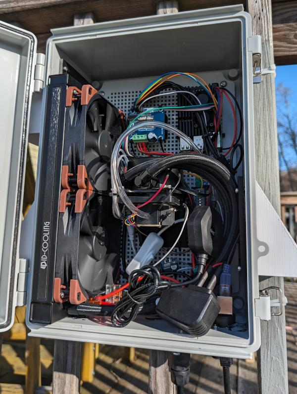

# chilly-boy
Open Source Chilled Mirror Hygrometer Project

## What is a Chilled Mirror Hygrometer
A Chilled Mirror Hygrometer (or Dew Point Mirror) measures the dewpoint of an environment by cooling a metal mirror until dew forms, measuring the temperature of the mirror continuously and using light reflected off the mirror to sense when dew has formed - [Wikipedia](https://en.wikipedia.org/wiki/Hygrometer#Chilled_mirror_dew_point_hygrometer)

## Advantages
- Typical consumer weather station humidity sensors use polymer-based capacitive humidity sensors, which are susceptible to contamination by certain VOCs such as acetone. These VOCs can stay diffused into the sensor and throw off the relative humidity readings for weeks or longer. [Reference](https://sensirion.com/media/documents/FEE9F039/62459F54/Application_Note_Heater_Decontamination_SHT4xX.pdf) - [Wikipedia](https://en.wikipedia.org/wiki/Hygrometer#Capacitive)
- When these polymer based sensors are exposed to >90% humidity they develop a temporary offset, increasing their readings by 4% or more. [Reference](https://sensirion.com/media/documents/A88858C9/629626D4/Application_Note_Creep_Mitigation_SHT4x.pdf)
- The Sensirion SHT45 is an excellent sensor and its heater can help mitigate these issues, but they cannot be fully avoided.

Dewpoint mirrors/chilled mirror hygrometers however, don't have these issues, or can easily mitigate them. VOC contamination can still happen while a dewpoint mirror is maintaining a continuous film of dew on the mirror, but can be briefly heated occasionally to fully remove the VOCs. Since the surface is a metal mirror and not an absorbent polymer VOCs are much more easily offgassed. Because the mirror maintains a continuous film of dew on the mirror, condensing levels of humidity pose no risk or outsized influence on measurements. Above 90% humidity the dewpoint mirror will continue to follow the dewpoint as at any other relative humidity reading.

## Disadvantages
- Speed: The biggest downside is that they're slow, relatively speaking. A typical capacitive humidity sensor can give you readings very quickly, in less than 10 milliseconds, while this CMH project can take several seconds to return an accurate reading and some CMHs may only be able to give readings once per minute. They can be made to give readings quicker, but due to the complexity of their readings they can't approach the same speeds of a capacitive sensor. That being said, for standard meteorological use where readings are averaged over 1 and/or 10 minutes, sub-second measurements are not nearly as important as consistency and accuracy.
- Size: Whereas capacitive sensors are often very small, the chips themselves being only a few millimeters across, due to their components CMHs are much harder to build compactly.
- Power consumption: Thermoelectric Coolers (or TECs) are compact, solid state, and able to both heat and cool the mirror rapidly, but require a relatively large amount of power. For example, the TEC2-25408 uses up to ~7 Amps at 12 Volts. [Wikipedia](https://en.wikipedia.org/wiki/Thermoelectric_cooling)
- Waste heat: Corollary to the higher power consumption, much of which is expelled as waste heat. The dew point does not fluctuate with temperature so it is unaffected by this waste heat, but some thought is required to manage the heated exhaust airflow to avoid influencing nearby temperature sensors.
- Maintenance: As implied by the name, its primary component is a dew-covered mirror, which can collect dust over time and does require occasional cleaning.

## Bill of Materials
Not including odds and ends, zipties, connectors, wires, screws, etc., the build shown above uses these components:
- Copper Heater Block: $12 https://www.amazon.com/dp/B09W4YMWCZ
- Adafruit MAX31865 PT100 Amplifier: $15 https://www.adafruit.com/product/3328
- Adafruit PT100 RTD: $12 https://www.adafruit.com/product/3290
- ~20mm 6mm OD 4mm ID copper tubing to adapt the PT100 to the heater block
- Adafruit TSL2591: $7 https://www.adafruit.com/product/1980
- Adafruit SHT4x Sensor:
    - This sensor is just for reference and peace of mind, the more accurate/expensive SHT45 is not required
    - SHT45 $12.50 https://www.adafruit.com/product/5665
    - SHT41 $6 https://www.adafruit.com/product/5776
    - SHT40 $6 https://www.adafruit.com/product/4885
- Adafruit StemmaQT to female dupont connectors: $1 https://www.adafruit.com/product/4397
- Adafruit StemmaQT 50mm cable: $1 https://www.adafruit.com/product/4399
- Hygger Aquarium Air Pump: $16 https://www.amazon.com/dp/B08HJ9JZKD
- BTS7960 Motor Driver: $11 https://www.amazon.com/dp/B00WSN98DC
- 3M 425 Aluminum Foil Tape: $17 https://www.amazon.com/dp/B007Y7DKWC
- ID-Cooling Frostflow X 240: $50 https://www.amazon.com/dp/B0BLS3372N
- ams OSRAM SFH 4544 940nm IR LED: $1 https://www.digikey.com/en/products/detail/ams-osram-usa-inc/SFH-4544/5231484
- Buck converter for stable LED power (~1.2v): $11 https://www.amazon.com/dp/B076H3XHXP
- TEC2-25408 2-stage peltier: $18 https://www.amazon.com/dp/B09F6997TV
- 6x M3x5x4mm heatset inserts
- Misc M3 socket head screws to mount the CPU heatsink, mirror enclosure, and fans
- Thermal paste for the peltier/heatsink/mirror (copper heater block)
- Raspberry Pi (Zero 2W/3B/4B/5B)
- MicroSD card for Raspberry Pi
- Power supply for the Raspberry Pi
- ~150W 12 Volt power supply for the TEC/peltier and cpu heatsink/fans
- ~18 AWG wire from 12V PSU to BTS7960 motor driver
- Misc female-to-female dupont jumper wires for motor driver, LED, buck converter/voltage regulator
- (Optional) Barrel plug to 3x 4-pin fan adapter: $8 https://www.amazon.com/dp/B08XTV4CSM
- (Optional) Barrel plug connector for fan adapter (not sufficient for peltier): https://www.amazon.com/dp/B09S3S6RYC
- (Optional) Barrel plug inline switch: https://www.amazon.com/dp/B07QXHC2NF
    - Those fans will easily draw blood, turn them off for safety during maintenance
- (Optional) CNLINKO LP-16 4pin: $14 https://www.amazon.com/dp/B08169TKZH
- (Optional) CNLINKO RJ45 socket: $16 https://www.amazon.com/dp/B0BLJWW6HQ
- (Optional) Ethernet cable from CNLINKO RJ45 plug to Raspberry Pi
- (Optional) Noctua NF-F12 iPPC-2000 IP67 fans: $28 https://www.amazon.com/dp/B00KFCRIQM
- (Optional) WAGO 221 Lever Nuts allow for easy removal of the sensor assembly from the housing

# Raspberry Pi Hardware Config
If not using a Pi4 or later, comment out `dtparam=audio=on` (the sound card uses the PWM channels, but Pi4+ have dedicated PWM for audio)